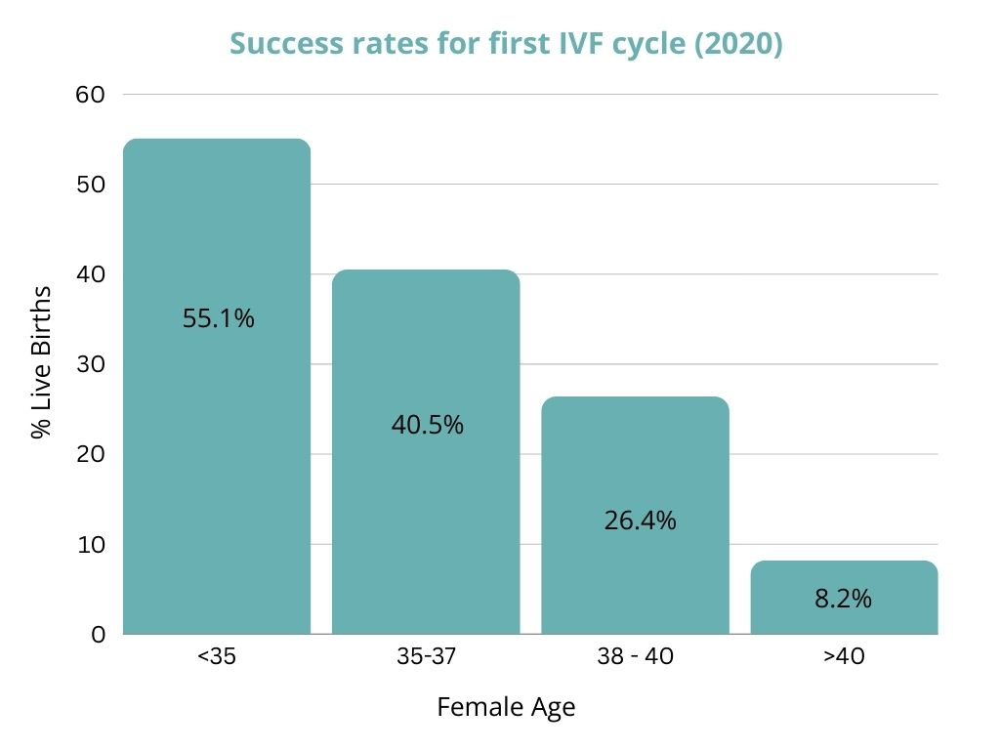

There is a lot of clarity in hindsight. When you’re on the path to IVF, life is already serving you a hard lesson. Here are the top five things I wish I knew before starting the IVF journey, some brutal honesty shared in the spirit of helping a sister out.

## 1. Support matters

Infertility is common…like really, really common! 1 in 6 people worldwide are affected by infertility according to a 2023 study by the World Health Organisation. 17.5% of the entire adult population. 
**WOW!** 
Think about that, if you have a friendship circle of 12 people, the chances are 2 of them have had/are having/will have fertility struggles. Yet…        
 
   

    
   
We don’t talk about it. Or at least not openly. The topic of infertility is still utterly taboo. This was the case for us in the beginning of our journey. In the first few years we believed we would get pregnant, it was just a matter of time. We reasoned that we could and should keep this deeply personal experience to ourselves.  
As time went on and on…and on, and the possibility of IVF started to appear on the horizon, we started to feel the weight on both sets of our very tired shoulders and so I shared what I was going through with a very dear friend. 
Imagine the surprise when said dear friend shared that she and her partner were going through the exact same thing. Similarly, later in the journey when I confided we were doing IVF with another close friend, she blurted out they had been to the same clinic! and said she suspected we were trying as she’d seen the prenatal vitamins on our kitchen countertop. 
Three of us going through the same heartache (6 of us if you count our partners), all orbiting one another, all with the unrealised ability to help each other feel less alone. 
Opening up to trusted confidants really did help. You will find great relief once you let others in. 

## 2. Your body is going to change

Hormones are powerful - amazingly powerful. If you’ve experienced PMS before, imagine that and then 10 X it (Ok, totally unscientific) but once you start taking fertility medications, you’ll experience hormones to a degree you will not have witnessed before.  
As a result your body will change. In some cruel twisted way, you may even appear pregnant. Think bloating, abdominal bruising, water retention, weight gain, skin changes and an inability to exercise normally leading up to and for a two week period after egg retrieval. Not fun. Truth be told, I expected the hormones to play havoc with my moods but the the degree to which my body changed - totally unprepared for. 
There are ways and means to support yourself through these changes. A good lymphatic massage (timed correctly) helps your body to eliminate any excess hormones. Personally I found that my hormones took longer to balance following a round of IVF - I did three cycles before the first transfer. The consultant advised this should not be the case but what can I say...ladies you know your body better than anyone. I found a home lymphatic massage helped me. Here's the trusty [lymphatic drainage tool](https://amzn.to/3RT50GQ) I have been using and swear by. 
The thing I have found most beneficial? 
Supportive self-talk. 
Affirmations always felt woo woo to me until I let the barrier drop. Personally, I found the silva method really helpful and once I got over myself, ‘every day in every way, I’m getting better and better and better’ became my mantra. Notice how you straighten your spine, lift your chin and feel empowered after repeating this aloud to yourself every day ;)  

## 3. It’s a lot of hurry up and wait

There is no denying that age is a factor (not the only one) when it comes to fertility. Once you start down the IVF route, you begin to hear this more and more from medical professionals. The longer the journey goes on, the more potential there is for this fact to play on your mind and feel like a pressure to hurry up. 
At the same time there is a lot of waiting. Wait for day 5 of your cycle. Wait for blood results. Wait for injections. Wait for follicles to grow. Wait for more blood tests. Wait for the Consultant to call. Wait for the egg to fertilise. Wait for the Embryologist to call. Wait, wait, wait. 
Hurry up and wait - conflicting right?! 
In many ways I was naive to the IVF process before starting. As a result the first cycle was tough. Honestly, probably tougher than it could have been. Lesson? 
Read what you can about the particular type of IVF treatment you will be receiving in advance. Just make sure the information is from reliable sources. Ask your Dr questions, lots of them - an informed patient is an empowered patient.

## 4. You may need more than one cycle

Reasons for infertility are complex. Your set of circumstances will be unique to you - there could be  any number of things working against you - endometriosis, ovulatory dysfunction, diminished ovarian reserve are a few of the more common ones. There is also unexplained infertility. The reality is, although treatment has come on leaps and bounds in the last 30 years, there are still huge gaps in the scientific knowledge. In many ways the miracle of life remains a mystery. 
That said, there is some solid evidence that breaks down IVF success rates by age. Data from the CDC shows women under 35 years old, the chances of success on the first cycle is 55.1%. For women aged 35- 37, it’s 40.5%. Women aged 38-40 old have a 26.4% chance of success on the first cycle and for women over 40 years old it’s 8.2%. 

(It is important to note that the above data only considers age and does not take into account any other possible contributing factors. Only a fertility doctor will be able to diagnose and give you the statistics most relevant to your circumstances). 
Look the statistics are the statistics, we can’t shy away from them. It’s better to be informed of the reality and THEN choose to see the glass as half full. When I look at this graph, I personally see chances. That was not always the case… 
and that’s OK. The IVF journey is a rollercoaster, truly. 
I do believe being equipped with this knowledge helps set realistic expectations for how many treatment cycles you may require. Nothing will ease the pain of a failed cycle but what this information offers is hope and sometimes what you need in the most difficult moments is exactly that - a reminder that there is a chance.

## 5. Your relationships will evolve

Your relationship with your partner, your relationship with your colleagues (if you’ve told your employer), your relationships with your friends and most importantly your relationship with yourself will all change. 
In all my research, this is one thing that I rarely if ever read about. Looking back, of course it makes sense. By far the biggest impact is on the relationship you have with yourself. Sure there is an impact on your relationship with your partner and this is sometimes talked about. What I see very little written about or talked about is how much more you will learn about yourself. 
You will discover parts of yourself that you didn’t know existed and honestly that is all sorts of scary and wonderful at the same time. If there is a gift in all of the struggle, developing your relationship with your yourself is it. It may not come wrapped up in a shiny bow, it may not be what you want but I promise you it is the gift you never knew you needed. 
Even with the despair and feelings of loss that come with a failed IVF cycle, there is a gain. 
It will not be immediately obvious. It will not be an A-ha moment, but in time, you will come to realise what you came through bruised you AND it shaped you. 
**You are infinitely wiser, infinitely stronger and acutely aware of how much of a miracle we all are.** 
So there you have it - 5 things I wish I’d known before starting IVF. Are you on an IVF journey or about to embark on one? If so, let me know if these honest words have helped and/or resonated by commenting below. 
For all the benefit of hindsight, there is ONE TRUTH I have learned that only comes with hard lessons - the strength of a woman is unmatched. Every woman I’ve met on this journey is strong, she has reserves deeper than she may even realise. 
Regardless of her fertility status, she is fully woman. 
 
This site contains affiliate links, view the disclosure for more information
